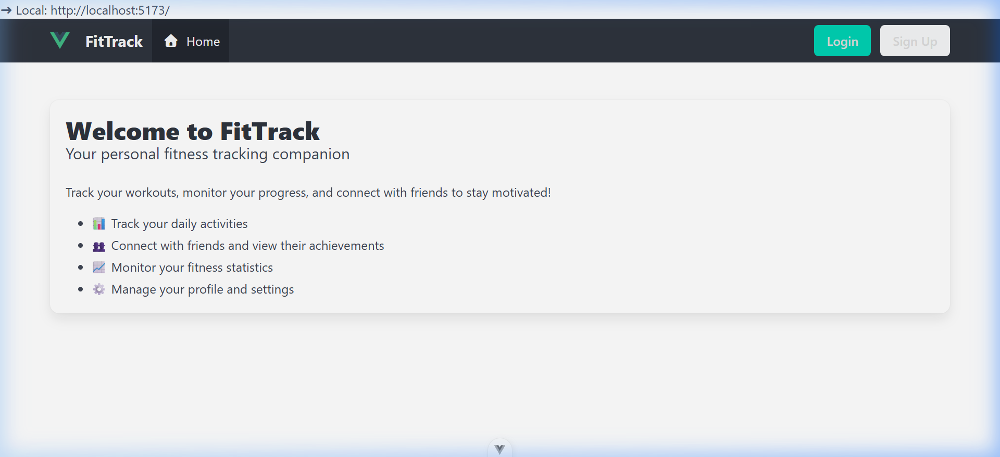
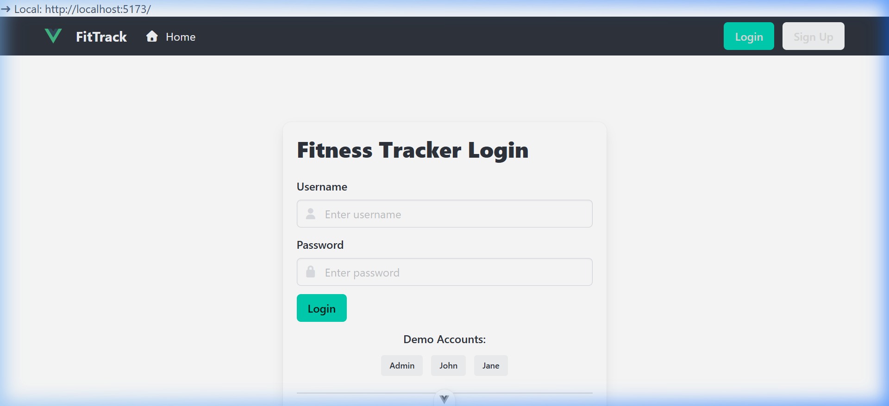
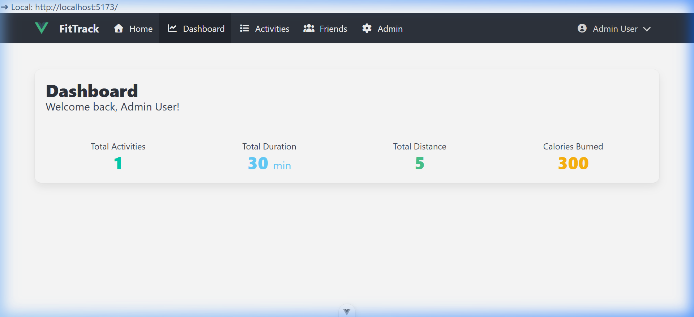
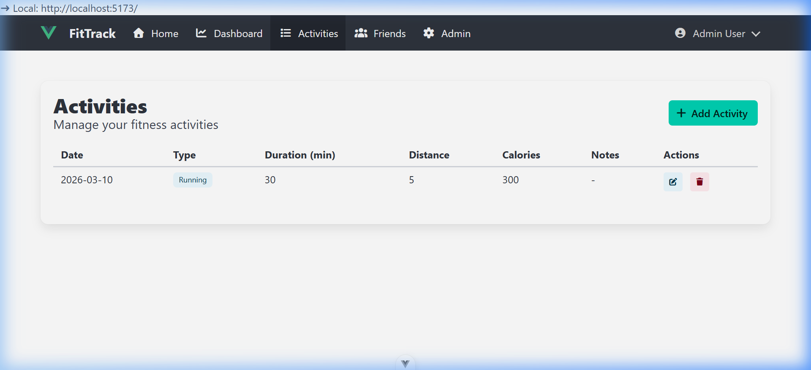
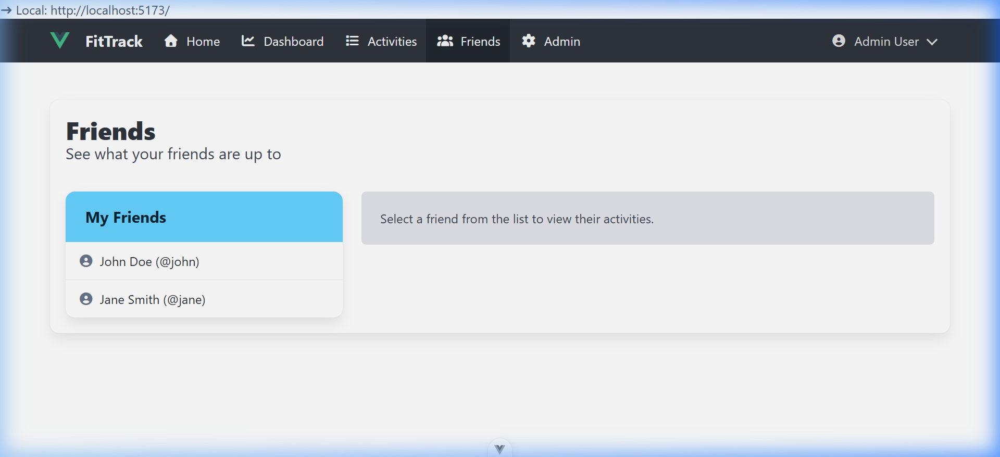
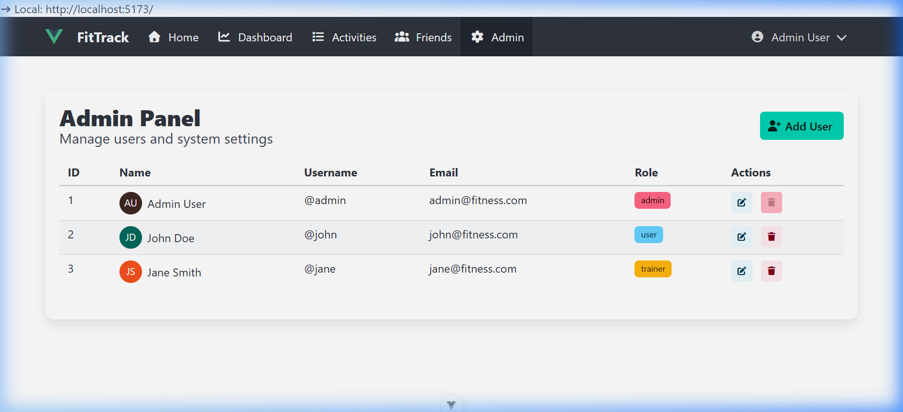
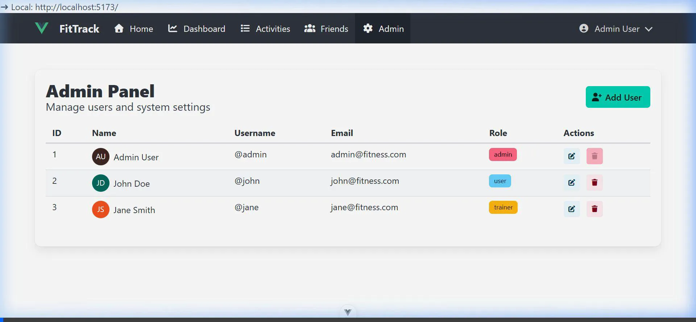

# Fitness Tracker Walkthrough

The Fitness Tracker application has been fully implemented according to the project requirements. Below is a detailed walkthrough of the final product.

## 🌟 Features Overview

- **Secure Session Management**: Authentication and role-based access control.
- **Dynamic Stats Dashboard**: Real-time summary of user activity.
- **Activity Management**: Full CRUD capabilities for tracking workouts.
- **Social Connection**: View read-only activity logs from friends.
- **Admin Management**: Dedicated area for system administrators to manage users.

---

## 📸 Project Showcase

_Home Page (Logged Out)_

_Login Page_

_Dashboard (Admin View)_

_Workout Activities_

_Viewer Friends Activities_

_Admin Panel (User Management)_

### 📽️ Interaction Recording
The following recording demonstrates the full user flow between logging in, viewing dashboard stats, and managing users/activities.

---

## ✅ Implementation Details

### 🛠️ Architecture
- **Framework**: Vue 3 (Composition API with `<script setup>`).
- **State Management**: Pinia (In-memory stores for Users, Auth, and Activities).
- **Styling**: Bulma CSS Framework with FontAwesome icons.
- **Routing**: Vue Router with role-based navigation guards.

### 📋 Checklist Status
- [x] Multiple user login support.
- [x] Tailored user experiences & data isolation.
- [x] Role-based access (User vs. Admin vs. Trainer).
- [x] Admin area for user CRUD.
- [x] Activity area for activity CRUD.
- [x] Friends area with read-only activity viewing.
- [x] Dashboard with activity statistics.

---

## 🚀 Deployment instructions
The project is ready for deployment to platforms like Render.
- **Root Directory**: `client`
- **Build Command**: `npm run build`
- **Publish Directory**: `dist`
